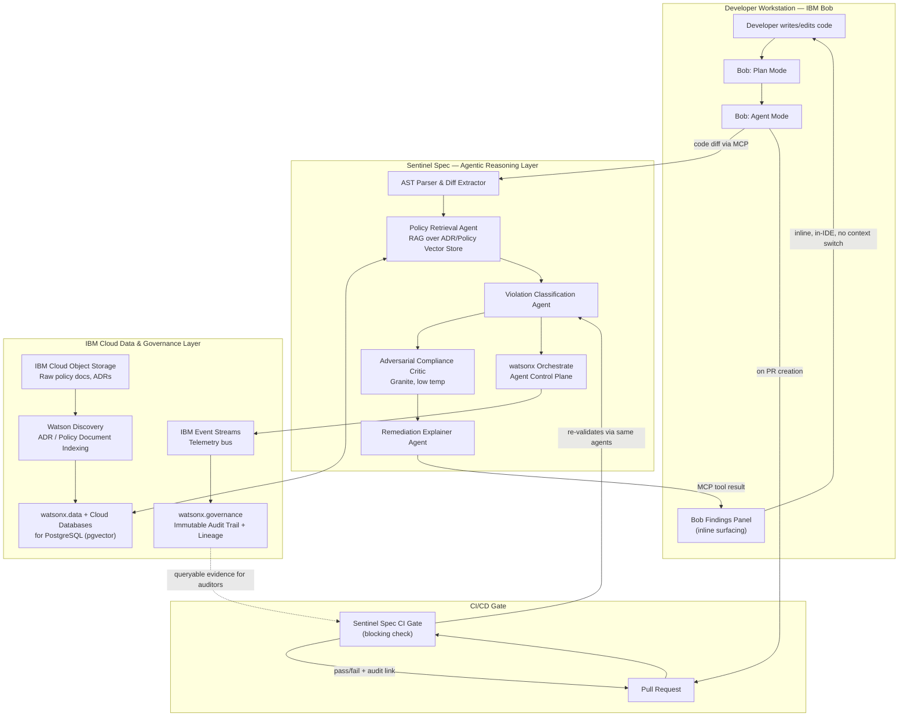

# Shift-Left Autonomous Compliance & Architecture Reviewer
### A Panel Analysis & Technical Blueprint — IBM Bob + watsonx Orchestrate

> **Panel:** Principal Cloud Architect (IBM Cloud & Hybrid Cloud) · Director of AI Engineering (Enterprise Agentic Systems) · Head of Developer Experience, Fortune 500 Production House

---

## 1. Comparative Track Analysis & Selection

| Dimension | Track 1 — Predictive Cloud FinOps & Architectural Drift Engine (Watson Studio AutoAI) | Track 2 — Shift-Left Autonomous Compliance & Architecture Reviewer (Bob + Orchestrate) |
|---|---|---|
| **Enterprise ROI** | Real, but slow-realizing — FinOps savings compound over months and compete with mature incumbents (CloudHealth, Kubecost, native AWS Cost Explorer ML features) that already do anomaly-detection-on-spend well. ROI is measurable but incremental, not disruptive. | Immediate and visible at the PR level — every blocked non-compliant merge, every caught architecture violation, is a unit of avoided incident cost, auditable in real time. ROI compounds *per commit*, not per billing cycle. |
| **Engineering Complexity** | Moderate-high: time-series forecasting, regression on cost/usage telemetry, drift-detection against IaC baselines. Largely a well-trodden MLOps pattern — AutoAI handles the modeling, the hard part is data pipeline plumbing, not novel system design. | High, and *novel* — requires AST-level static analysis, a RAG pipeline over a living architecture-decision-record (ADR) corpus, multi-agent reasoning with hallucination guardrails, and deep IDE-native integration with human-approval gating. This is systems engineering, not just ML pipeline engineering. |
| **Market Novelty (2026)** | Crowded. "AI FinOps" is now table stakes in every major cloud cost platform; IBM itself ships Turbonomic for this exact problem. Differentiation is thin. | Genuinely underserved. GitHub Copilot and most AI coding assistants operate at the *code-correctness* layer, not the *organizational-policy-conformance* layer. Few tools combine IDE-native enforcement with an immutable, governed audit trail suitable for SOC2/ISO27001/FedRAMP evidence. IBM Bob's GA-stage "Bob Findings," Plan/Agent modes, and native Orchestrate MCP integration make this buildable *today* in a way that wasn't true 12 months ago. |

**Panel decision: Track 2.** The Director of AI Engineering's view carries the room: FinOps-via-AutoAI is a sound but commoditizing pattern — you would be building a slightly better version of a tool IBM already sells (Turbonomic) and several well-funded startups already sell. The Shift-Left Compliance Reviewer, by contrast, sits at a genuine 2026 inflection point — Bob's GA release explicitly exposes the building blocks (Ask/Plan/Agent modes, "Bob Findings," checkpoints, MCP tool generation, native watsonx Orchestrate deployment) needed to build an enterprise-grade autonomous reviewer *without* having to build an IDE plugin platform from scratch. The Head of DevEx adds the deciding practical point: developer tools that *prevent* costly production incidents at commit-time have a categorically different (and easier to sell) ROI story than tools that *optimize spend after the fact* — "stop the bleeding" beats "trim the fat" in every enterprise budget conversation.

---

## 2. The Chosen Solution: Architecture & Concept

### Project Name & Elevated Pitch

**Sentinel Spec** — *Autonomous, Governed Architecture & Compliance Conformance for the Agentic SDLC.*

Sentinel Spec is a multi-agent reviewer that lives inside IBM Bob and continuously validates every proposed code change — not just for syntax or style, but for conformance against a living, RAG-indexed corpus of the organization's architecture decision records (ADRs), security policies, data-residency rules, and compliance frameworks (SOC2, HIPAA, PCI-DSS, internal API contracts) — *before* a human reviewer ever opens the pull request, and produces an immutable, watsonx.governance-tracked audit trail for every decision it makes.

### The Micro-Bottleneck

The exact, costly problem: **architecture and compliance violations are caught too late and too inconsistently.** In large production houses, a senior architect's hard-won knowledge — "we don't call that legacy billing service directly, always go through the idempotency gateway," "PII fields must never be logged, even in debug mode," "this microservice boundary was deliberately drawn this way after the 2024 outage" — lives in Slack threads, tribal memory, and ADRs nobody re-reads. A junior or mid-level engineer (or an AI coding assistant generating code at 10x the previous velocity) routinely violates these unwritten rules. The violation is caught, if at all, during human code review — by which point engineering time has already been spent, context has been lost, and the reviewer becomes a bottleneck precisely *because* AI-accelerated code generation (Bob, Copilot, etc.) has increased the *volume* of code arriving for review without increasing reviewer bandwidth. Stanford's 2025/2026 industry survey on AI-assisted development confirms this exact failure mode: AI coding tools accelerate generation but the resulting "slop" and rework cost frequently erases the gain on brownfield, high-complexity systems — precisely because nothing is checking architectural conformance at generation time, only at the end.

Sentinel Spec moves the check to the only point where it's cheap to fix: the moment the code is being written, inside the IDE, before a PR even exists.

### System Architecture (Mermaid)

**Key architectural property:** the *exact same* agent pipeline (Retrieval → Classification → Critic → Explainer) runs twice — once synchronously inside Bob's IDE session for instant in-editor feedback, and once again as a CI gate at PR time using watsonx Orchestrate as the headless control plane. This isn't duplication; it's a deliberate **defense-in-depth pattern**: the IDE-time check is advisory and fast (optimized for developer flow), while the CI-time check is the actual enforcement boundary, re-running the full pipeline against the final diff to prevent a developer from ignoring or bypassing in-IDE warnings. The Principal Cloud Architect's note here: this mirrors the "shift-left, never trust client-side validation alone" principle from web security, applied to architectural governance.

---

## 3. Deep-Dive IBM Component Integration

### IBM Bob: Native, Zero-Context-Switch Surfacing

Bob's GA feature set is what makes the "no context switching" requirement achievable rather than aspirational:

- **Bob Findings tab** is the literal delivery surface — Sentinel Spec's Remediation Explainer Agent writes its output directly into this native panel, the same surface Bob already uses for its own security/quality findings, so from the developer's perspective Sentinel Spec violations look and feel like a first-class Bob capability, not a bolted-on plugin with its own UI.
- **Plan mode** is where Sentinel Spec hooks in *earliest* — before any code is written, when a developer asks Bob to "think through architecture or create a technical plan," Sentinel Spec's Policy Retrieval Agent is invoked via MCP to inject relevant ADR constraints directly into Bob's planning context, so the generated plan is policy-aware from the first draft rather than corrected after the fact.
- **Agent mode + custom modes/skills** is where the enforcement check actually executes against real diffs, using Bob's documented capacity to read files, execute terminal commands, and invoke MCP tools — Sentinel Spec ships as an MCP server (exactly the pattern IBM's own tutorials demonstrate for connecting Bob to watsonx Orchestrate) exposing tools like `check_architecture_conformance(diff)` and `explain_violation(violation_id)`.
- **Checkpoints** give the human-in-the-loop safety net the Director of AI Engineering insists on: if Sentinel Spec's Critic agent is wrong (a false positive blocking valid code), the developer's full edit history is checkpointed and recoverable — no risk of an overzealous compliance agent corrupting work.
- **Literate Coding mode** (review-before-apply) ensures any *auto-remediation* Sentinel Spec proposes (e.g., "wrap this call in the idempotency gateway") is presented as a reviewable diff, never silently auto-applied — directly addressing the "developers need to stay in control" principle that distinguishes disciplined AI-SDLC tooling from raw vibe coding.
- **Bobalytics** (Bob's enterprise analytics layer) is reused, not duplicated — Sentinel Spec emits its violation/remediation events onto the same telemetry stream Bobalytics already ingests, giving engineering leadership a single pane of glass for both "developer productivity" and "compliance posture" rather than two disconnected dashboards.

### watsonx Orchestrate: Agent Training, Orchestration, and Hallucination Guarding

watsonx Orchestrate functions here as the **agent control plane** — the same role it plays in IBM's own documented Bob integration pattern (Bob generates the agent and MCP tooling; Orchestrate hosts, schedules, and governs it at runtime):

- **Agent topology hosted in Orchestrate:** Policy Retrieval Agent → Violation Classification Agent → Adversarial Compliance Critic → Remediation Explainer Agent, wired as a deterministic DAG (not a free-form planner) for the same reason argued in prior architecture work on this kind of system: compliance-checking is a deterministic-adjacent domain where unconstrained re-planning adds latency and non-determinism without adding value.
- **Hallucination guarding, concretely:**
  1. *Grounding constraint:* the Classification Agent is prohibited from asserting a policy violation unless it can cite a specific retrieved ADR/policy chunk ID — any classification without a citation is automatically downgraded to "needs human review" rather than "blocking violation."
  2. *Adversarial Critic gate:* a second Granite-powered agent, run at low temperature with a stricter, narrower system prompt, re-checks the Classification Agent's citation against the actual retrieved text using a lightweight entailment check — rejecting any classification where the cited policy doesn't actually entail the claimed violation. This is the same two-stage "synthesizer proposes, critic adversarially verifies" pattern that meaningfully reduces false-positive blocking, which is the single fastest way to lose developer trust in a compliance bot.
  3. *Confidence-banded enforcement:* only high-confidence, dual-agent-confirmed violations become CI-blocking; medium-confidence findings surface as warnings in Bob Findings; low-confidence findings are logged to watsonx.governance for trend analysis but never surfaced inline, keeping signal-to-noise high enough that developers don't learn to ignore the tool.
- **Training/tuning the underlying skill-set:** rather than fine-tuning a base model, the system is built on **prompt-engineered Granite agents grounded via RAG** over the organization's actual ADR corpus — this is deliberately the cheaper, faster-to-iterate, more auditable path (every decision traces to a retrievable document) versus a fine-tuned model whose "knowledge" of company policy would be opaque and hard to update when an ADR changes. When an ADR is revised, the vector store re-indexes immediately and the agents' behavior changes on the next query — no retraining cycle.

### IBM Cloud Core Services

| Service | Role |
|---|---|
| **Watson Discovery** | Ingests and indexes the raw corpus of ADRs, security policy docs, compliance framework text (SOC2 control language, internal API contracts), producing the structured, queryable base the vector store is built from |
| **IBM Cloud Databases for PostgreSQL + watsonx.data** | Hosts the pgvector-backed embedding store the Policy Retrieval Agent queries; watsonx.data provides the lakehouse layer for raw/structured policy artifacts |
| **IBM Cloud Object Storage** | Source-of-truth storage for raw ADR/policy documents and historical violation evidence artifacts |
| **IBM Event Streams** | Kafka-compatible bus carrying real-time violation/remediation events from both the IDE-time and CI-time agent runs into the governance and analytics layers |
| **watsonx.governance** | The immutable audit trail itself — every classification, every citation, every human override is logged as a lineage record, queryable later as direct compliance evidence (the artifact an actual SOC2/ISO27001 auditor would ask for) |

---

## 4. The "Unfair Advantage" (Market Differentiation)

The Head of DevEx frames this section: **GitHub Copilot and similar tools optimize for "does this code work and look idiomatic." They have no concept of "is this code allowed."** That distinction is the entire moat:

- **Organizational-policy grounding, not general code quality.** Copilot's suggestions are trained on public code and general best practice; they cannot know that *this specific company* forbids direct calls to a specific legacy service, or that *this specific team's* ADR from 18 months ago deliberately rejected a pattern Copilot would otherwise suggest. Sentinel Spec's RAG layer is grounded exclusively in the tenant's own governed document corpus — a structurally different, non-replicable knowledge base.
- **Immutable, auditor-grade evidence trail.** Standard tools like AWS CloudWatch or generic linters produce logs; they do not produce watsonx.governance-style lineage records suitable as direct compliance evidence. For regulated industries (financial services, healthcare, government), the ability to hand an auditor a queryable, tamper-evident record of "every architectural decision an AI assistant influenced, what policy it checked against, and who overrode what" is a categorically different deliverable than a CloudWatch log stream.
- **Data isolation as an architectural property, not a configuration option.** Because the entire policy corpus and vector store live inside the enterprise's own IBM Cloud tenancy (Cloud Object Storage, Cloud Databases for PostgreSQL, watsonx.data), no proprietary architecture knowledge ever leaves the customer's governance boundary to train or improve a third-party model — directly addressing the data-exfiltration concern that has already publicly dogged AI coding tools (Bob itself had an early CLI-manipulation vulnerability disclosed and patched pre-GA, underscoring why customers in regulated industries specifically demand this isolation guarantee).
- **Multi-cloud/hybrid governance reach.** Because Bob explicitly supports mainframe and legacy modernization workflows (RPG, COBOL, Java upgrades) alongside modern cloud-native development, Sentinel Spec's same policy-conformance pattern extends to legacy-modernization compliance checking — a use case no general-purpose coding assistant addresses at all, and a direct line into IBM's existing mainframe/IBM i customer base.
- **Defense-in-depth enforcement, not advisory-only.** Because the identical agent pipeline runs both inside the IDE (advisory) and as a CI gate (blocking, via Orchestrate as headless control plane), the system cannot be bypassed by a developer simply ignoring an inline suggestion — a structural guarantee neither Copilot nor a standalone CloudWatch alert can offer.

---

## 5. Phases of Execution (MVP to Enterprise-Ready)

### Phase 1 — Proof of Concept (2–3 weeks, single repo, single policy domain)

Focus entirely on proving the core loop, not breadth. Hand-curate 15–20 ADRs/policies for one real repository (pick a security-sensitive domain — PII handling or a known legacy-service boundary — for maximum demo impact). Build only: AST diff extractor, single-stage RAG retrieval, one Classification Agent (no separate Critic yet), and direct Bob Findings surfacing via a minimal MCP server. Skip CI-gate enforcement, skip watsonx.governance integration, skip Orchestrate hosting — run the agent pipeline as a simple FastAPI service Bob calls via MCP. Goal: demonstrate, live, that Bob flags a real policy violation inline, in-editor, with a correct citation, with zero context switch. This phase deliberately avoids boilerplate — no auth system, no multi-tenancy, no UI beyond what Bob already provides.

### Phase 2 — Hardened Reviewer (4–6 weeks, multi-policy-domain, CI-gated)

Add the Adversarial Compliance Critic and confidence-banding logic — this is the phase where false-positive rate becomes the primary engineering metric, tracked explicitly. Move agent hosting onto watsonx Orchestrate as the real control plane (rather than a bare FastAPI service), wire the second, CI-time invocation of the same pipeline as a blocking GitHub Actions/Tekton check, and stand up the watsonx.governance lineage logging so every decision is now auditable. Expand the policy corpus to 3–4 domains (security, data residency, API contract conformance, a legacy-service boundary rule) to prove the RAG layer generalizes beyond the single hand-tuned PoC domain. Introduce Watson Discovery for automated ADR ingestion (replacing the Phase 1 hand-curation) so new policy documents are indexed without manual pipeline changes.

### Phase 3 — Enterprise-Ready Platform (8–12 weeks, multi-repo, multi-tenant, audit-grade)

Generalize to a true platform: multi-repository, multi-team policy scoping (different teams' ADR corpora isolated via the same Port-and-Adapter-style separation pattern used for tenant isolation in RAG SaaS systems generally), full Bobalytics-integrated dashboards correlating violation trends with team/repo/time, and a formalized human-override workflow where a senior architect's manual approval of a flagged "violation" is itself captured as a governed event (closing the loop: overrides become training signal for refining the policy corpus, not silently discarded). This is also the phase to harden against the exact CLI-manipulation/data-exfiltration vector class publicly disclosed against early Bob — sandboxed execution for any auto-remediation suggestions, strict MCP tool permissioning, and a security review of the Sentinel Spec MCP server itself before it's trusted with write-adjacent capabilities across the full engineering org.
