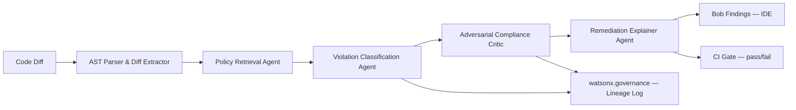

# Technical Requirements Document (TRD)
## Sentinel Spec — Autonomous Architecture & Compliance Reviewer

| | |
|---|---|
| **Status** | Draft v1.0 |
| **Owner** | TBD |
| **Related docs** | PRD — Sentinel Spec, Implementation Plan — Sentinel Spec |

---

## 1. System Overview

Sentinel Spec is a multi-agent reasoning pipeline, invoked identically from two trigger points — synchronously inside IBM Bob (IDE-time, advisory) and as a headless CI gate via watsonx Orchestrate (PR-time, enforcing) — that retrieves relevant organizational policy/ADR context for a code diff via RAG, classifies potential violations, adversarially verifies those classifications, and writes both developer-facing findings and immutable governance records.



## 2. Architecture Principles

1. **Deterministic DAG, not a free-form planner.** Compliance checking is a deterministic-adjacent domain; an unconstrained re-planning agent adds latency and non-determinism without adding value. The pipeline is a fixed sequence: Retrieve → Classify → Critique → Explain.
2. **Defense in depth.** The identical pipeline runs at IDE-time (advisory, fast, optimized for flow) and at CI-time (enforcing, re-validates the final diff). A developer cannot bypass enforcement by ignoring an inline warning.
3. **No claim without a citation.** The Classification Agent may not assert a violation without a specific, retrievable source chunk ID. Uncited claims are automatically downgraded to "needs human review," never "blocking."
4. **Confidence banding, not binary pass/fail.** Findings are bucketed (high/medium/low confidence) and only high-confidence, dual-agent-confirmed findings are CI-blocking.
5. **RAG over fine-tuning.** All organizational knowledge is grounded via retrieval against a live, re-indexable vector store, not baked into model weights — when an ADR changes, behavior changes on the next query, with no retraining cycle and a fully auditable source for every assertion.

## 3. Component Specification

### 3.1 AST Parser & Diff Extractor

- **Input:** raw git diff / Bob's in-session edit buffer.
- **Output:** structured `CodeChangeUnit` objects — one per logical change (function added/modified, import added, API call introduced, etc.), each carrying file path, language, AST node type, and surrounding context window.
- **Implementation note:** language-specific AST parsers (e.g., `tree-sitter` bindings) wrapped behind a single `DiffExtractorPort` so additional languages can be added without touching downstream agents.

```python
@dataclass(frozen=True)
class CodeChangeUnit:
    file_path: str
    language: str
    change_type: Literal["added", "modified", "removed"]
    ast_node_type: str          # e.g. "function_call", "import_statement"
    snippet: str
    context_window: str         # surrounding lines for retrieval grounding
    diff_id: str
```

### 3.2 Policy Retrieval Agent

- **Input:** `CodeChangeUnit` list.
- **Output:** `RetrievedPolicyContext` — top-k relevant policy/ADR chunks per change unit, with similarity scores and source chunk IDs.
- **Backing store:** vector embeddings of the ADR/policy corpus (see Section 4 for storage mapping).
- **Embedding model:** consistent embedding model across indexing and query time (mismatch here is a common, easy-to-miss bug class — enforced via a single `EmbeddingPort` used both at ingestion and query time).

```python
@runtime_checkable
class PolicyRetrievalPort(Protocol):
    async def retrieve(self, change_unit: CodeChangeUnit, k: int = 5) -> list["PolicyChunk"]: ...

@dataclass(frozen=True)
class PolicyChunk:
    chunk_id: str
    source_document: str       # e.g. "ADR-0042-idempotency-gateway.md"
    text: str
    similarity_score: float
```

### 3.3 Violation Classification Agent

- **Input:** `CodeChangeUnit` + `RetrievedPolicyContext`.
- **Output:** `ClassificationResult` — verdict, cited chunk IDs, confidence, rationale.
- **Hard constraint enforced in the prompt and validated programmatically post-response:** every `violates: true` verdict must include at least one `cited_chunk_id` drawn only from the chunks actually provided. Any response citing a chunk_id not in the input set is rejected and the change unit is automatically routed to `needs_human_review`.

```python
GRANITE_CLASSIFIER_SYSTEM = """You are a policy conformance classifier. You will
receive a CODE CHANGE and a set of POLICY CHUNKS retrieved as potentially relevant.

Respond with ONLY a JSON object matching this schema:
{
  "violates_policy": <bool>,
  "cited_chunk_ids": ["<chunk_id>", ...],
  "confidence": <float 0-1>,
  "rationale": "<concise explanation citing only the provided chunks>"
}

Rules:
- NEVER cite a chunk_id not present in the provided POLICY CHUNKS.
- If the change does not clearly violate any provided chunk, set violates_policy to false.
- If you are uncertain, reflect that honestly in a lower confidence score rather than
  defaulting to a violation.
"""
```

### 3.4 Adversarial Compliance Critic

- **Input:** `ClassificationResult` + the original cited `PolicyChunk` text.
- **Output:** `CriticVerdict` — confirms, downgrades, or rejects the classification.
- **Design:** runs as a *separate* Granite call, lower temperature (0.0–0.1), narrower system prompt, performs a lightweight entailment check ("does the cited policy text actually entail the claimed violation, given the code change?"). This is a distinct model invocation from the Classifier — not the same call reused — specifically to avoid the failure mode where a single agent's own reasoning error compounds uncorrected.

```python
GRANITE_CRITIC_SYSTEM = """You are an adversarial verifier. You will receive a
CLASSIFICATION CLAIM and the exact POLICY TEXT it cites. Your only job is to
determine whether the cited text actually, specifically entails the claimed
violation — not whether it's plausible or related.

Respond with ONLY:
{
  "entailed": <bool>,
  "reasoning": "<one sentence>"
}

Be strict. If the policy text is about a related-but-distinct topic, entailed
must be false."""
```

### 3.5 Remediation Explainer Agent

- **Input:** confirmed `ClassificationResult` (post-Critic).
- **Output:** `RemediationSuggestion` — human-readable explanation, suggested fix as a reviewable diff (not auto-applied), formatted for Bob Findings panel rendering.

### 3.6 Confidence Banding & Routing Logic

```python
def route_finding(classification: ClassificationResult, critic: CriticVerdict) -> FindingTier:
    if not critic.entailed:
        return FindingTier.REJECTED  # not surfaced at all
    if classification.confidence >= 0.85 and critic.entailed:
        return FindingTier.BLOCKING       # CI-gate blocking
    if classification.confidence >= 0.5:
        return FindingTier.WARNING        # surfaced, non-blocking
    return FindingTier.LOGGED_ONLY        # governance log only, not surfaced inline
```

## 4. Infrastructure & Service Mapping

| Component | Service | Notes |
|---|---|---|
| Vector store (policy embeddings) | IBM Cloud Databases for PostgreSQL + pgvector, fronted by watsonx.data | One logical namespace per policy corpus; multi-tenant scoping (FR11) implemented as a `tenant_id`/`team_id` filter at the Port boundary, not trusted to the underlying store alone |
| Raw policy/ADR documents | IBM Cloud Object Storage | Source of truth; Watson Discovery indexes from here |
| Document indexing | Watson Discovery | Phase 2+; Phase 1 uses manual embedding script over hand-curated docs |
| Agent hosting / control plane | watsonx Orchestrate | Hosts the Retrieve→Classify→Critique→Explain DAG for the CI-time invocation; Phase 1 PoC runs this as a bare FastAPI service instead (see Implementation Plan) |
| IDE integration | IBM Bob, via MCP server | Sentinel Spec ships its own MCP server exposing `check_architecture_conformance(diff)` and `explain_violation(violation_id)` tools |
| Event/telemetry bus | IBM Event Streams | Carries violation/remediation events from both trigger points into governance and analytics |
| Governance/audit log | watsonx.governance | Immutable lineage records — see Section 5 for schema |
| CI execution | GitHub Actions / Tekton (IBM Cloud Continuous Delivery) | Blocking check step calling the same pipeline via Orchestrate API |

## 5. Data Model

### 5.1 Governance Lineage Record (immutable, append-only)

```json
{
  "record_id": "uuid",
  "timestamp": "ISO-8601",
  "trigger": "ide_time | ci_time",
  "actor": "developer_id",
  "repo": "string",
  "diff_id": "string",
  "change_unit": { "file_path": "...", "ast_node_type": "..." },
  "retrieved_chunks": ["chunk_id", "..."],
  "classification": {
    "violates_policy": true,
    "confidence": 0.91,
    "cited_chunk_ids": ["ADR-0042#3"]
  },
  "critic_verdict": { "entailed": true, "reasoning": "..." },
  "finding_tier": "blocking | warning | logged_only | rejected",
  "override": {
    "occurred": false,
    "actor": null,
    "justification": null,
    "approver": null
  }
}
```

### 5.2 Policy Chunk (vector store row)

```json
{
  "chunk_id": "string",
  "source_document": "string",
  "text": "string",
  "embedding": "vector(N)",
  "policy_domain": "security | data_residency | api_contract | architecture",
  "team_scope": "string | null",
  "last_indexed": "ISO-8601"
}
```

## 6. API Surface (MCP Tools Exposed to Bob)

```yaml
tools:
  - name: check_architecture_conformance
    description: "Checks a code diff against organizational architecture/compliance policy."
    input_schema:
      diff: string
      file_path: string
      language: string
    output_schema:
      findings: array of Finding

  - name: explain_violation
    description: "Returns full citation, rationale, and suggested remediation for a finding."
    input_schema:
      violation_id: string
    output_schema:
      explanation: string
      cited_policy: PolicyChunk
      suggested_fix_diff: string | null

  - name: submit_override
    description: "Records a developer override of a blocking finding with justification."
    input_schema:
      violation_id: string
      justification: string
      actor: string
    output_schema:
      recorded: boolean
```

## 7. Failure Modes & Handling

| Failure | Behavior |
|---|---|
| Vector store unreachable at IDE-time | Advisory check skipped silently (logged), developer not blocked — flow preservation prioritized for the advisory path |
| Vector store/Orchestrate unreachable at CI-time | Gate fails **open** with a prominent logged warning and a notification to the on-call/architecture channel — explicit tradeoff per PRD NFR; revisit per-policy-domain if stricter fail-closed behavior is required |
| Classifier cites a chunk_id not in the retrieved set | Response rejected programmatically; change unit routed to `needs_human_review`, logged as a model-error event distinct from a policy violation |
| Critic and Classifier disagree | Critic's verdict is authoritative (it is the trust boundary by design) — `entailed: false` always overrides regardless of Classifier confidence |
| Embedding model version mismatch between index-time and query-time | Build-time check: vector store rows carry the embedding model version used; query-time refuses to compare across mismatched versions and logs a re-indexing alert |

## 8. Security Considerations

- MCP tool permissions for Sentinel Spec are scoped read-diff / write-finding only through Phase 1–2. No write-to-codebase capability exists until Phase 3, and only as a human-reviewed suggested diff (never auto-applied), per PRD FR12.
- Given Bob's own disclosed pre-GA CLI-manipulation vulnerability class, Sentinel Spec's MCP server itself is in scope for a dedicated security review before Phase 3 write-adjacent capability is enabled — input sanitization on anything that becomes part of a prompt (diff content, file paths) is mandatory to prevent prompt-injection-via-code-comment style attacks.
- All policy corpus data and embeddings remain inside the customer's IBM Cloud tenancy (Cloud Object Storage / Cloud Databases for PostgreSQL) — no data path exists that would use proprietary architecture knowledge to train or fine-tune any model outside that boundary.

## 9. Open Technical Questions

1. Embedding model choice — confirm whether to use a watsonx.ai-hosted embedding endpoint consistently, or a local model in decoupled/dev environments (mirrors the dual-mode pattern from prior architecture work — worth reusing the same `EmbeddingPort` abstraction if dual-mode support is desired for Sentinel Spec too).
2. Tree-sitter grammar coverage — confirm initial language scope (assume Python + Java for Phase 1, given Bob's strong Java support, expand from there).
3. Multi-tenant vector namespace strategy — single table with `team_scope` filter (simpler, Phase 1-appropriate) vs. fully separate vector store instances per team (stronger isolation, higher operational overhead) — recommend starting with the filtered single-table approach and revisiting if isolation requirements tighten.
